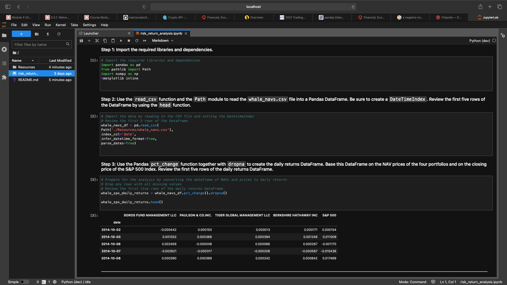
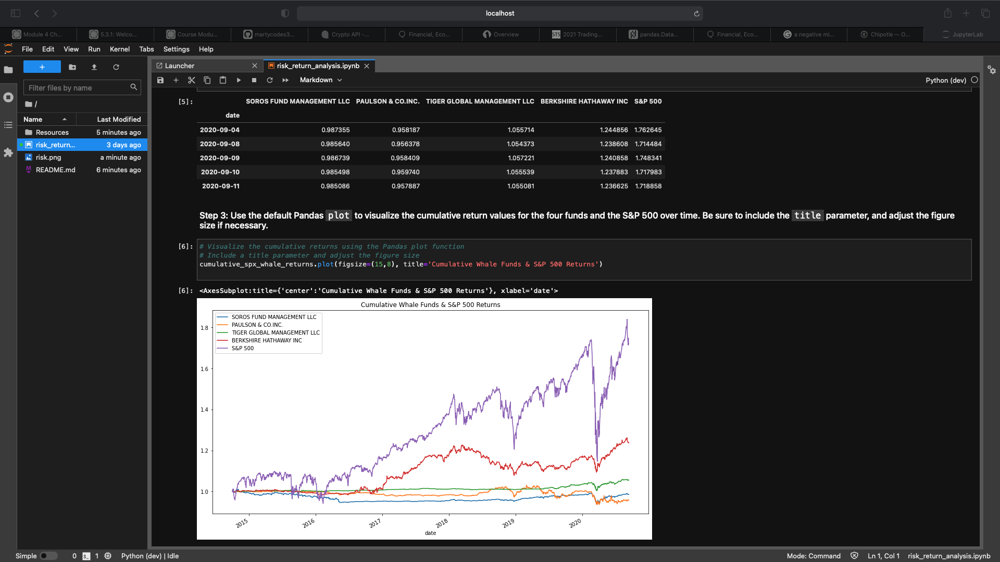

# Risk Return Analysis, Whale Funds & S&P 500

---

This is a Jupyter Lab via command line interface created code used with the assitance of Pandas to create an analysis of DataSets that compared 4 large hedgefunds to the S&P 500 index to determine if their risk was worth the return compared to the 'market'. This project contains visualizations of the different risk profiles of the hedge funds Soros Fund Management LLC, Pauson & Co. INC, Tiger Global Management LLC, Berkshire Hathaway INC, as well as the S&P 500. The goal was to determine which fund(s) would best compliment a portfolio depending on it's risk/return over the past 5 years.
---

## Technologies

This project uses python 3.7 with the following packages:

* [Pandas](https://github.com/pandas-dev/pandas) - Pandas is an open-source library that offers easy-to-use data analysis tools for Python.

* [Jupyter Lab](https://github.com/jupyterlab/jupyterlab-git) - For interactive analysis prompts and a code as you code structure


 
---

## Installation Guide

Before running the application first install the following dependencies.


* [Install] Anaconda with Python 3.7+(https://docs.anaconda.com/anaconda/install/)
You should always be in a conda dev environment when launching JupyterLab.
 


---

## Usage

To view the risk_return_analysis.ipynb, open Terminal/ Use CLI

```conda activate dev
cd <location of (risk_return_analysis.ipynb)>
jupyter lab
```

Upon launching the Jupyter Lab application you will be greeted with the following prompts.




As Well as the following Visualizations.



---

## Contributors

Brought to you by MartyCodes333 (martique.henton@gmail.com) with the help of 2021 UW FinTech Bootcamp Instructors, TA's and Fellow Classmates


---